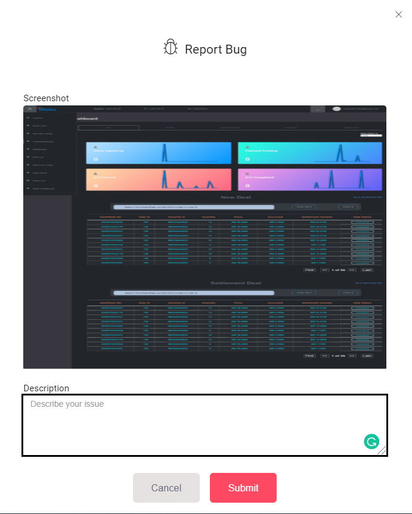
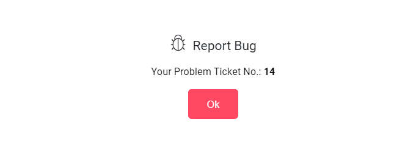

# report-bugs

## Installation

```bash
npm install --save report-bugs
```

## Import the report-bugs Library.

```js
import BugReport from "report-bugs";
```

## Usage

```js
<BugReport
  user={current_username}
  app_id={current_appname}
  color={bug_icon_color}
  reportLink={destination_link}
  headerAuthParam={headerAuthParam}
/>
```

## Props

user : _string_ (current logged in user)
app*id : \_string* (client app name)
color : _string_ (bug icon color)
reportLink : _Link_ (API Endpoint)
headerAuthParam : _string_ (Authentication header)

## Working

- Users can report a bug anywhere in our app by clicking on the Bug Icon. As soon as the user clicks the bug icon , captureScreenhot() method is called and a screenshot of the current screen is taken by using the html2canvas method. This method takes a DOM element as input and returns it's image i.e. body in our case. The image is then converted to base64 encoded URL using  image_name.toDataURL() method and stored in the this.state.

```js
captureScreenShot = async () => {
  const canvas = await html2canvas(document.querySelector("body"));
  const base64 = canvas.toDataURL("image/jpeg");
  this.setState({ screenshot: base64, modal: true });
};
```

- The page_id of the page on which the bug icon is clicked is fetched by using  window.location.pathname which returns the filename of the current page. The description given by the user in text area is also stored in this.state .

```js
this.state = {
  page_id: window.location.pathname.slice(1),
};
```

- when user clicks the submit submitHandler() is called which makes a post request to adminbugreport Api and Page id , user id, description, app_id and base64 encoded screenshot are sent to the backend and stored in customer_error_report table. If successful the Api returns a BugID which is displayed to the user on screen.

```js
const body = { page_id, user_id, desc, app_id, screenshot };
const res = await Axios.post(Endpoints.adminbugreport, body);
const bugId = res.data.body;
```




MIT © [developer@bondsindia.com](https://wwww.bondsindia.com)
